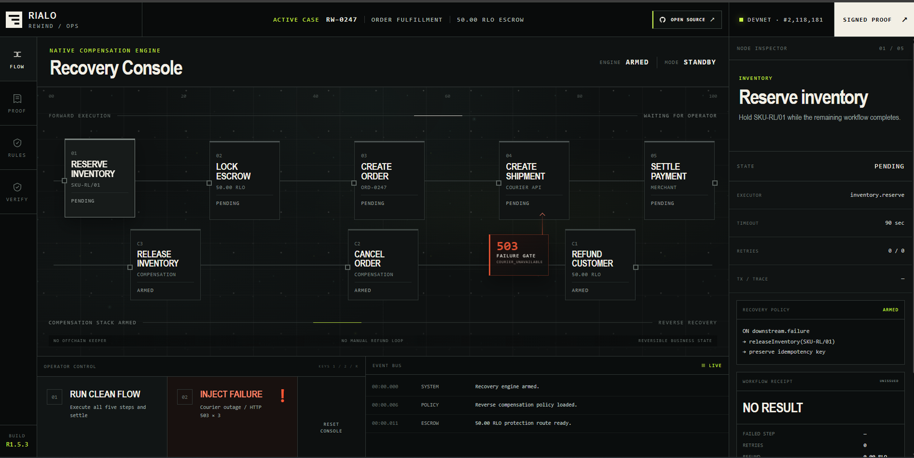
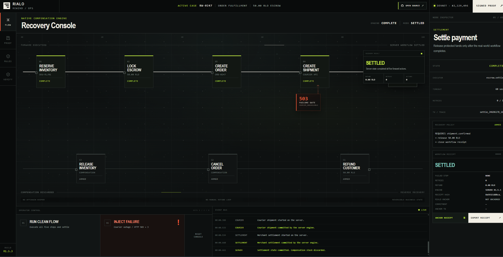
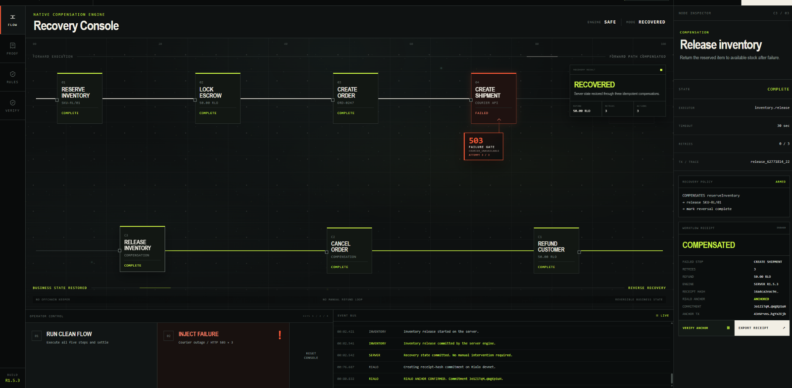
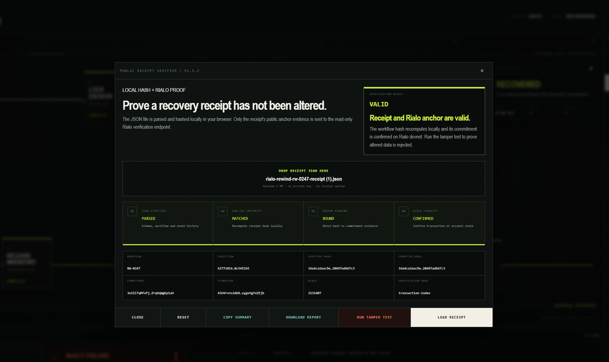
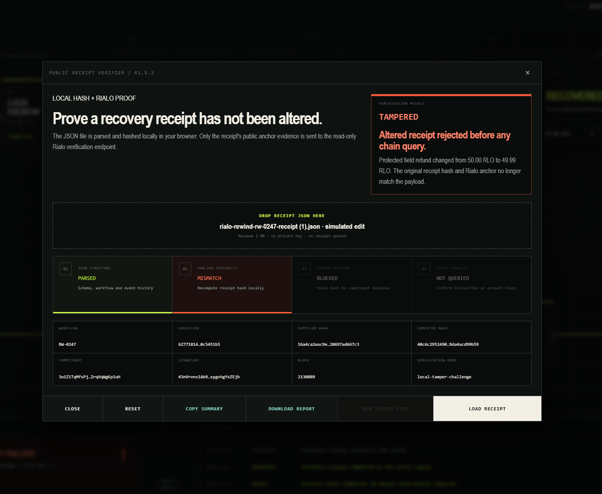

# Rialo Rewind R1.5.3

**Native compensation and recovery engine for real-world workflows on Rialo.**

[Live demo](https://rialo-rewind.vercel.app) · [Architecture](docs/ARCHITECTURE.md) · [Security](docs/SECURITY.md) · [Demo guide](docs/DEMO.md)

Rialo Rewind demonstrates a server-side workflow that can complete normally, stop at a controlled downstream failure, compensate prior business effects in reverse order, issue a portable receipt, anchor that receipt on Rialo devnet, and let any viewer independently verify or reject the receipt.



## What it proves

- A clean five-step workflow can settle normally.
- A courier failure is retried three times before forward execution stops.
- Completed business effects are compensated in reverse order: `refund → cancel → release`.
- Recovery actions use workflow-scoped idempotency keys.
- The final receipt is portable JSON with a SHA-256 integrity hash.
- The receipt hash is committed through a real Rialo devnet transaction.
- An unchanged receipt verifies as `VALID`.
- A modified receipt is rejected as `TAMPERED` before any chain query.

## Verified flows

### Clean settlement



### Automatic recovery and Rialo anchoring



### Public receipt verification



### Local tamper rejection



## Core capabilities

- Server-side forward workflow execution through `/api/workflow`
- Clean settlement and controlled HTTP 503 failure paths
- Three-attempt courier retry ceiling
- Reverse compensation in `refund → cancel → release` order
- Workflow-scoped idempotency keys
- Before/after business state and event traces
- Portable `rialo-rewind.receipt.v2` JSON receipts
- SHA-256 receipt integrity hashes
- Real Rialo devnet signed proof and receipt-hash commitment transaction
- Transaction-index or account-state anchor verification
- Browser-local public receipt verification
- Deterministic `VALID` and `TAMPERED` challenge paths
- Copyable verification summaries and downloadable verification reports
- Responsive recovery-console UI with animated Rialo signal field
- Same-origin API checks, input validation, no-store responses, and rate limiting

## Honest boundary

The inventory, escrow, merchant, and courier adapters are controlled server-side sandbox systems built to demonstrate recovery semantics. They are not connected to third-party production commerce APIs.

The receipt anchor is a real Rialo devnet transfer to a receipt-hash-derived commitment address. It is not represented as a dedicated Rialo registry program or memo instruction.

Rialo Rewind does not require a browser wallet. Devnet proof actions use disposable server-side keys, and no seed phrase or private key reaches the browser.

## Demo path

1. Run **RUN CLEAN FLOW** and confirm `SETTLED`.
2. Reset and run **INJECT FAILURE**.
3. Observe three courier retries and the failed `CREATE SHIPMENT` step.
4. Confirm reverse compensation: `refund → cancel → release`.
5. Confirm the final `COMPENSATED` receipt.
6. Select **ANCHOR RECEIPT** and wait for Rialo confirmation.
7. Export the receipt JSON.
8. Open **VERIFY**, load the receipt, and confirm `VALID`.
9. Run **TAMPER TEST** and confirm `TAMPERED` before any chain query.
10. Copy the verification summary or download the public report.

See [`docs/DEMO.md`](docs/DEMO.md) for the presenter checklist.

## Validation status

Verified on 30 July 2026:

- `31/31` automated tests passed
- JavaScript syntax checks passed
- Static production smoke check passed
- Production clean flow reached `SETTLED`
- Production failure flow reached `COMPENSATED`
- Receipt anchoring reached `ANCHORED`
- Original receipt verified as `VALID`
- Simulated alteration was rejected as `TAMPERED`

## Commands

```bash
npm test
npm run check
npm run smoke
```

## Structure

- `api/` — Vercel workflow, anchor, proof, and read-only verification endpoints
- `src/server/` — deterministic recovery engine
- `src/core/` — receipt, anchor, workflow, and verifier models
- `src/rialo/` — Rialo CDK clients and proof/anchor adapters
- `src/receipt-verifier.js` — browser-local verifier and report export
- `tests/` — model, engine, API contract, UI contract, and version tests
- `docs/` — architecture, security, roadmap, screenshots, demo, and release materials

## Release status

R1.5.3 freezes the public demo surface. Future development should focus on a dedicated Rialo receipt registry/program and production adapters rather than adding cosmetic features to this release.
